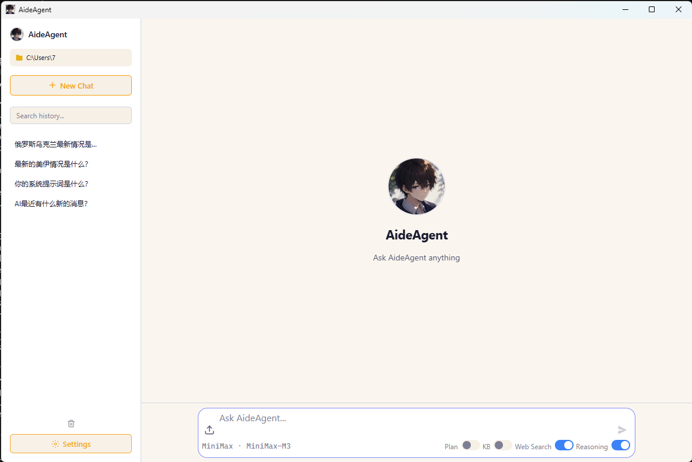
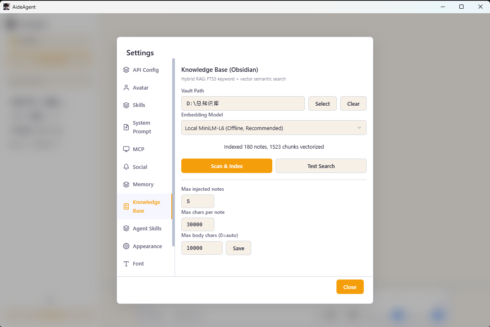
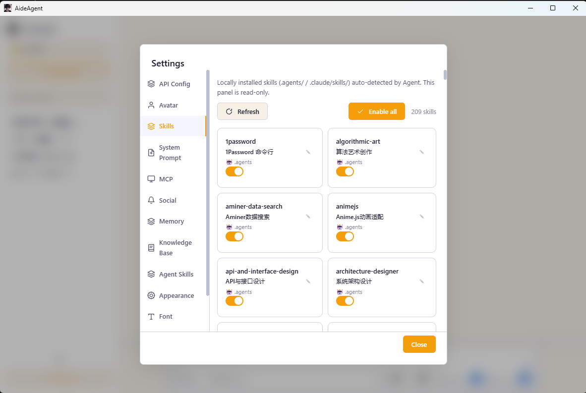
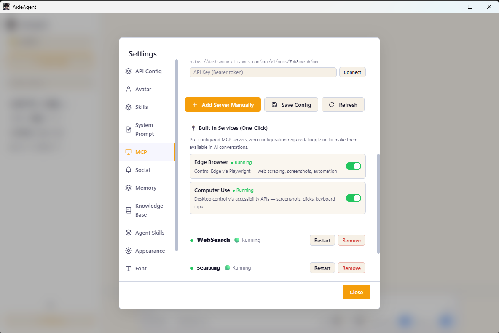

# AideAgent

> A desktop assistant that puts AI on your machine. Not just chat — it actually does the work.

---

## What this is

AideAgent is an AI desktop app that runs on your computer (cloud models are supported too). It's not a chat window — it can call tools, read your notes, drive a browser, connect to your WeChat, and even hand the wheel to a local OpenCode CLI as the agent engine.

If you're the kind of person who wants AI to *do things for you*, not just *talk to you* — this project is for you.



---

## The problem it solves

Off-the-shelf AI tools are awkward in their own ways:

- **Web-based chat** — the conversation ends, and the AI can't do anything else.
- **Other desktop AI** — either chat-only, hard to extend, or your data lives in the cloud.
- **CLI agents** — no GUI, high setup bar, brutal for non-developers.

AideAgent tries to cover all three:

- **Chat** (the input box in the lower-left is the conversation)
- **Act** (tools, commands, web search, notes search, file edits)
- **Reach you** (WeChat bridge, local model support, your data stays on disk)
- **Extend** (MCP protocol, Skills system, add whatever you want)
- **Two runtimes, one app** — flip a card on the welcome screen between the built-in AideAgent loop and a local OpenCode CLI

---

## Two runtimes — pick on the welcome screen

The very first thing you see is a card chooser with two engines:

- **AideAgent** — the built-in agent loop. Custom tool executor, in-process reasoning, fast iteration. This is the default.
- **OpenCode** — if you have the `opencode` CLI installed locally, AideAgent can hand the entire session over to it via the [Agent Client Protocol](https://agentclientprotocol.com/). You get the full OpenCode experience without leaving the GUI.

When you pick OpenCode but the CLI isn't on `PATH`, an install guide pops up with one-click links to `npm i -g opencode-ai`, `scoop install opencode`, or `brew install opencode`, plus a "Re-detect" button to pick it up after you install.

The choice is persisted per-user (`localStorage["AideAgent_runtime"]`) and re-applied on session restore — but if you restore an OpenCode session and the CLI is no longer installed, we quietly fall back to AideAgent and surface a toast so you're not confused about why the input box swapped.

### OpenCode mode selector

When runtime = OpenCode, the bottom-left of the input box has a 3-mode dropdown (instead of the single Plan toggle AideAgent uses):

| Mode | What it does |
|------|--------------|
| **Build** (default) | Normal execution. Reads, edits, and runs commands. |
| **Plan** | Read-only. Outputs a plan, asks before touching files. |
| **Authorize** | Auto-approves every operation. For "I trust you, just go" sessions. |

Your mode choice is persisted (`AideAgent_oc_mode`) and re-applied on the next launch.

### OpenCode file upload

OpenCode supports file attachments via the `+` button on its input box — images go inline (`{type:"image"}`) so the model can see them directly; everything else (PDF, Markdown, source, etc.) is written to a temp file and attached as a `resource_link` with a `file://` URI. The model can then call `file_read` on the URI. This is the most reliable path we found against opencode v1.17.9 — the inline-text `{type:"resource"}` route silently stalled the response in our testing, so `resource_link` is the only fallback we ship.

### OpenCode model picker

OpenCode's `initialize` handshake returns the models the server supports; AideAgent mirrors that list into its own dropdown so you can pick a model without leaving the GUI. The same dropdown lives in both runtimes' info bars.

---

## What it can do (one screenshot per capability, matching the toggles in the UI)

The four toggles under the input box correspond to four capabilities:

### 1. 📋 Plan — break down and execute tasks

When toggled, the AI won't just dive in. It plans first, then executes. For "I want to build something but I haven't thought through the details" situations.

> AideAgent runtime only — OpenCode uses the 3-mode dropdown above.

### 2. 📚 KB — knowledge base search

Point it at your Obsidian vault (or any Markdown folder), and the AI will search your notes before answering. Think of it as local RAG glued onto your AI.



### 3. 🌐 Web Search — live web search

Toggle it on when you need real-time info. A built-in meta-search engine (Bing + GitHub, no API key required), plus an optional paid Tavily integration.

### 4. 💡 Reasoning — think deeper

Lets the model spend more time thinking, for more thorough answers (only works if your model supports it).

The four buttons above the input box — **Messages**, **Tools**, **Skill**, **MCP** — are the extension layers:

- **Tools** — built-in tools (read file, write file, run command, fetch web page, etc.)
- **Skill** — auto-discovered from `.agents/skills/` or `.claude/skills/` directories (200+ found on a typical scan)
- **MCP** — external services via Model Context Protocol (Edge browser, local search, remote APIs, …)
- **+** (next to the input box) — popover with quick access to file upload, prompt library, and skills

---

## Six capabilities (ordered from "lightest touch" to "deepest reach")

### 1. Multiple models — pick whoever you want

Click **API Config** and you'll see 10 presets, ready to go:

- **DeepSeek** — V4-Flash / V4-Pro
- **GLM (Zhipu)** — GLM-4.7-Flash / GLM-4-Plus / GLM-4-Air
- **Qwen (Tongyi Qianwen, Alibaba)** — Qwen3.7-Max / Qwen-Plus / Qwen-Turbo
- **Claude (Anthropic)** — Sonnet 4 / Opus 4 / Haiku 4.5
- **MiniMax** — M2.7 / M2.7-Highspeed
- **Ollama** — local, drop in any model you've pulled
- **LM Studio** — local, with the GUI
- **llama.cpp** — local, the server mode
- **OpenCode Go (OpenAI-compatible)** — `opencode.ai/zen/go` (GLM 5.1/5.2, Kimi K2.6/K2.7, DeepSeek V4, Mimo V2.5, …)
- **OpenCode Go (Anthropic-compatible)** — `opencode.ai/zen/go` (MiniMax M2.5/M2.7/M3, Qwen3.6/3.7-Plus, Qwen3.7-Max, …)

Both **OpenAI-compatible** and **Anthropic** API formats are supported, so you can swap in any third-party proxy or self-hosted endpoint that speaks the same language. Custom base URLs are also fine — just paste your own.

API keys are encrypted by the operating system keychain (Windows DPAPI / macOS Keychain / Linux libsecret), never stored in plaintext.

---

### 2. Knowledge base — AI reads your notes and documents

Point it at your Obsidian vault (or any folder), and the AI will search your notes before answering.

Supported file formats (toggleable in Settings → Knowledge Base):
- **Markdown** — `.md` / `.mdown` / `.mkd` / `.mkdn` / `.markdown` (always on)
- **Word** — `.docx` (default on, parsed via `mammoth`)
- **PowerPoint** — `.pptx` (default on, parsed via direct OOXML XML extraction)
- **CSV / TSV** — `.csv` / `.tsv` (default off, each row → "column: value" sentence)
- **Excel** — `.xlsx` (default off, parsed via SheetJS, multi-sheet support)
- **PDF** — `.pdf` (shipped in v1.29, parsed via `pdf-parse`)

Under the hood: SQLite + FTS5 full-text search + ONNX running a local embedding model (`all-MiniLM-L6-v2`, 384 dimensions), fused with RRF. Fully offline. Nothing leaves your machine.

On first launch, model files download automatically (via a `postinstall` hook, pulling from `hf-mirror.com` or `huggingface.co`).

The extractor architecture is pluggable — each format lives in `desktop/kb/extractors/` and implements a standard `{ extract, chunkText }` interface. Adding a new format is one file + one registry entry.

---

### 3. Skills system — teach AI to do specific things

A Skill is a folder under `.agents/skills/` or `.claude/skills/` containing a SKILL.md that says "I can do X". The AI invokes the right one when it fits.



- **Local Skills** — auto-scanned, individually toggleable (the screenshot shows 209 skills enabled)
- **Agent Skills** — skills you create yourself
- Writing a Skill is just writing a Markdown file — low barrier

---

### 4. MCP ecosystem — plug in any external service

MCP (Model Context Protocol) is Anthropic's protocol — think of it as a "USB port" for AI apps. AideAgent ships with several one-click services:



- **Edge Browser** — Playwright-driven Edge, can screenshot, fill forms, scrape data
- **Computer Use** — simulates mouse and keyboard through system accessibility APIs (off by default, turn on with care)
- **Web Search** (built-in) — keyless meta-search
- **filesystem** — controlled file read/write, scoped to your user directory
- **Remote MCP** — HTTP with custom headers, plug in whatever you want

You can also add any MCP server that `npx` can run.

---

### 5. WeChat bot — bring AI into your WeChat

On startup the app tries to launch the WeChat iLink Bot bridge. Scan to log in and you get:

- Desktop chats with the AI auto-mirrored to WeChat
- Messages you send in WeChat get replied to by the AI

API config syncs to the WeChat side too (same conversation context).

> Implementation lives in `desktop/core/wechat-bridge.mjs` — QR scan → polling → bearer token → bidirectional message push, all wired up.

---

### 6. Extensibility and automation — for developers

If you're a developer, these will keep you busy for a while:

- **Full IPC interface** — every feature exposed as an IPC handler, script it however you like
- **Two agent runtimes** — built-in AideAgent loop + OpenCode via ACP. Same UI, different engines
- **Test coverage** — Vitest unit tests + Playwright E2E (in Electron mode)
- **Type checking** — `tsc --noEmit` passes across the whole project (JS source with JSDoc type annotations)
- **Cross-platform packaging** — `electron-builder` produces Windows NSIS, macOS DMG, and Linux deb+AppImage in one shot
- **Auto-update** — `electron-updater` pulls new versions from GitHub Releases
- **i18n** — Chinese and English UI, switchable in Settings → Language

---

## Project layout

```
AideAgent/
├── desktop/                          # Electron desktop app
│   ├── main.mjs                      # main process entry
│   ├── preload.cjs                   # preload bridge (CJS)
│   ├── core/                         # core modules (IPC, tool execution, state, ...)
│   │   ├── agent-loop.mjs            # built-in agent loop (tool calls + reasoning)
│   │   ├── opencode-acp-client.mjs   # OpenCode ACP client (spawns `opencode acp`, JSON-RPC over stdio)
│   │   ├── opencode-detector.mjs     # detects local `opencode` binary (PATH + common install locations)
│   │   ├── ipc-handlers.mjs
│   │   ├── state.mjs
│   │   ├── tool-executor.mjs
│   │   ├── tool-definitions.mjs
│   │   ├── wechat-bridge.mjs
│   │   └── ...
│   ├── kb/                           # knowledge base (FTS5 + vector + format extractors)
│   │   ├── vault-scanner.mjs         # recursive vault scan (format-aware)
│   │   ├── indexer.mjs               # full rebuild + single-file reindex
│   │   ├── search.mjs                # hybrid RAG: FTS5 + vector + RRF + LLM rerank
│   │   ├── markdown.mjs              # Markdown parsing + heading-based chunking
│   │   ├── formats.mjs               # extension → extractor registry + enable/disable
│   │   ├── extractors/               # per-format text extractors (pluggable)
│   │   │   ├── index.mjs             # extractor dispatch
│   │   │   ├── markdown.mjs          # .md adapter (wraps kb/markdown.mjs)
│   │   │   ├── docx.mjs              # .docx via mammoth
│   │   │   ├── pptx.mjs              # .pptx via OOXML ZIP parsing
│   │   │   ├── csv.mjs               # .csv/.tsv → "col: val" sentences
│   │   │   ├── xlsx.mjs              # .xlsx via SheetJS (multi-sheet)
│   │   │   └── chunk-utils.mjs       # paragraph-based chunking for non-Markdown
│   │   └── ...
│   ├── renderer/                     # renderer (vanilla JS, no framework)
│   │   ├── app.js                    # main entry (orchestrates modules)
│   │   ├── translations.js           # i18n (zh + en)
│   │   ├── index.html                # UI shell
│   │   ├── style.css
│   │   └── modules/                  # feature modules
│   │       ├── runtime-selector.mjs  # AideAgent vs OpenCode chooser + 3-mode dropdown
│   │       ├── file-previews.mjs     # shared file-chip renderer for both runtimes
│   │       ├── knowledge-base.mjs
│   │       ├── skills-panel.mjs
│   │       ├── mcp.mjs
│   │       ├── wechat.mjs
│   │       ├── memory-panel.mjs
│   │       ├── prompt-store.mjs
│   │       └── ...
│   ├── mcp-manager.mjs               # MCP protocol manager
│   ├── lsp-manager.mjs               # LSP client (TS/JS)
│   ├── session-db.mjs                # session storage (SQLite + FTS5)
│   ├── knowledge-store.mjs           # knowledge base (FTS5 + vector)
│   ├── memory-store.mjs              # memory storage
│   ├── skills-store.mjs              # skills catalog
│   ├── prompts-store.mjs             # prompts storage
│   ├── update-manager.mjs            # auto-update manager
│   ├── search-engine/                # meta-search engine (Bing + GitHub)
│   └── scripts/
│       └── download-model.mjs        # downloads ONNX model on first run
├── kb/                               # default knowledge base directory
├── models/                           # local model files (generated at runtime)
└── docs/                             # documentation + screenshots
```

Tech stack, one line: **Electron 40 + vanilla JS (no frontend framework) + node:sqlite + ONNX Runtime + MCP + Agent Client Protocol**.

---

## Quick start

### Requirements

- Node.js 22.5+ (because we use the built-in `node:sqlite` module)
- npm (the project ships a lockfile)
- (Optional) the `opencode` CLI on your `PATH` — only needed if you want the OpenCode runtime. Install with `npm i -g opencode-ai@latest`, `scoop install opencode`, or `brew install opencode`

### Run it

```bash
cd desktop
npm install         # automatically downloads the embedding model (~25MB)
npm start
```

If the model download fails (network issues), set an env var and retry:

```bash
# China mirror takes priority (default order in download-model.mjs)
HF_ENDPOINT=https://hf-mirror.com npm install
```

To debug the OpenCode ACP protocol (verbose stdio logging):

```bash
DEBUG_OPENCODE_ACP=1 npm start
```

### Build installers

```bash
npm run dist:win     # Windows NSIS
npm run dist:mac     # macOS DMG
npm run dist:linux   # Linux deb + AppImage
npm run dist:all     # all three platforms
```

Built installers land in `desktop/release/`.

### Development mode

```bash
npm run dev          # Electron + DevTools
npm run test         # Vitest unit tests
npm run test:e2e     # Playwright E2E (Electron mode)
npm run lint         # ESLint
npm run typecheck    # tsc --noEmit
```

---

## Nice details

- **Local-first data** — sessions, note indexes, skills, and memory all live in `~/.aideagent/`, never uploaded
- **Encrypted API keys** — OS Keychain, never plaintext
- **Auto-migration on first launch** — upgrading from an older version (`~/.goodagent/`)? Config migrates automatically
- **Strict CSP** — the renderer ships with a complete Content Security Policy
- **MCP config compatible with Claude Code format** — copy your existing `.mcp.json` over and it just works
- **Per-runtime persistence** — your runtime pick (AideAgent / OpenCode), OpenCode mode (Build / Plan / Authorize), and OpenCode model are all stored in `localStorage` and re-applied on every launch
- **i18n** — Chinese and English UI, switchable in Settings → Language. Every label, button, modal, and toast has a translation entry
- **OpenCode resilience** — per-request 120s timeout on the ACP channel, so a dead subprocess surfaces "opencode 无响应" instead of hanging the UI

---

## Contact & thanks

The repo lives at [github.com/quanzefeng/AideAgent](https://github.com/quanzefeng/AideAgent).

If you find this useful, **a ⭐ Star** is the biggest encouragement for the author.

Issues, PRs — all welcome. Feature ideas, bug reports, usage questions — any of those.

---

## A final word

This project doesn't have a fancy roadmap, and it doesn't claim to be "building AGI". It's just a small tool written by people who thought "AI should be able to actually help me do things".

If you feel the same way, feel free to use it, and feel free to change it.

If you've read this whole README and still don't know what it does — **install it and play with it for two minutes**. Skip the docs.
