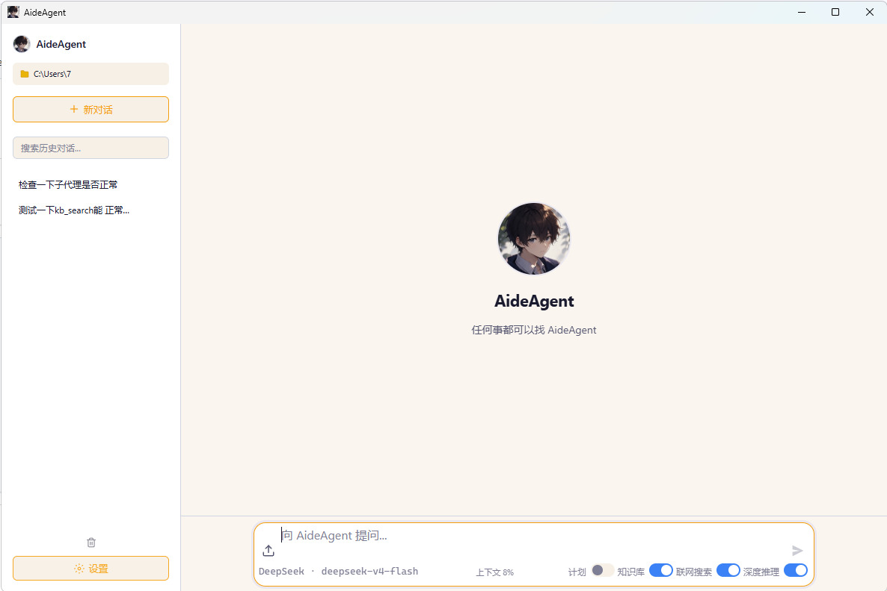
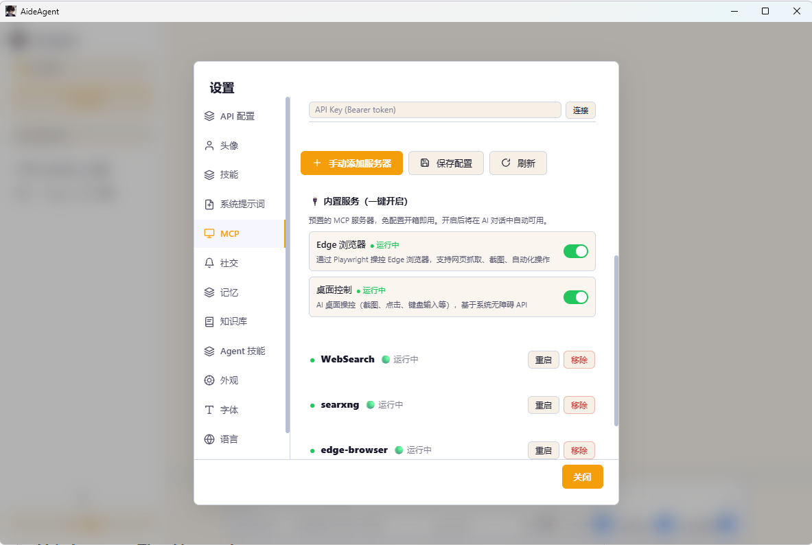
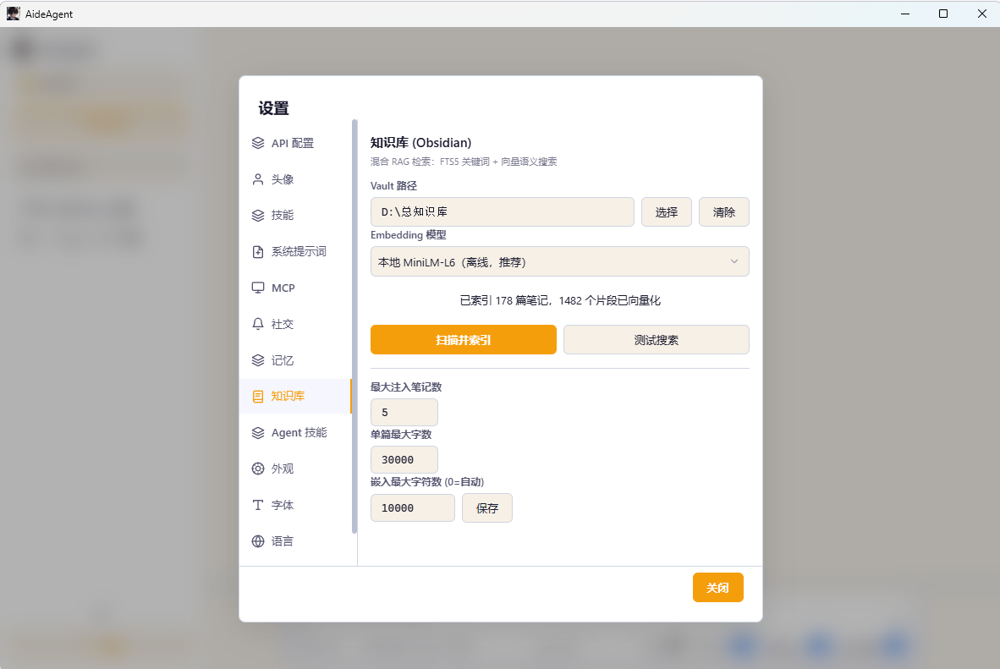
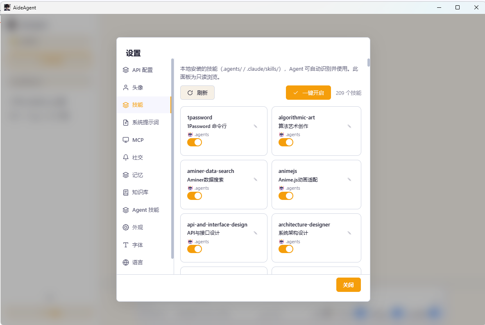

<div align="center">

# 🤖 AideAgent

### A local-first desktop AI assistant with RAG, Hooks, MCP, and WeChat bot — fully open-source, Apache-2.0.

[](https://github.com/quanzefeng/AideAgent/releases)
[](https://opensource.org/licenses/Apache-2.0)
[](https://www.electronjs.org/)
[](https://nodejs.org)
[](#-download)

</div>

---

## 👀 What is AideAgent?

AideAgent is a **local-first desktop AI assistant** focused on privacy, deep extensibility, and zero vendor lock-in. It's **free and open-source (Apache-2.0)** — your data stays on your machine.

- 🛡️ **Your data never leaves your machine** — offline MiniLM-L6 embedding, OS-encrypted API keys, SSRF protection
- ⚡ **Save 90% on API bills** — explicit Prompt Caching (Anthropic + DeepSeek) with live hit-rate display<sup>[1](#caching-benchmark)</sup>
- 🧰 **34 built-in tools** — file/shell/git/GitHub/MCP/LSP/skill/kb, all in one binary
- 🔌 **Plays nice with the ecosystem** — auto-detects Claude Code/Desktop MCP configs, access 350K+ skills via skills.sh
- 💬 **WeChat bot** — talk to your agent from your phone

> Built by one developer in 24 days. **17 releases. 199+ commits. 25+ test files. ~200MB desktop app.**

<sup id="caching-benchmark"><b>[1]</b></sup> *Cache hit-rate benchmark: 90% saving measured on Anthropic Claude Sonnet 4.5 with a 50K-token multi-turn coding conversation, using explicit `cache_control` markers on system + tools + history (1-hour TTL). Methodology and reproduction scripts: [docs/prompt-caching.md](docs/prompt-caching.md).*

---

## 📸 Preview

<table>
<tr>
<td width="50%">

**Main Chat Interface**  
Left sidebar with session list and working directory, streaming conversation in the center, 4 smart toggles at the bottom (Plan Mode / Knowledge Base / Web Search / Deep Reasoning)



</td>
<td width="50%">

**MCP Servers (Tool Ecosystem)**  
Built-in 4 MCP servers: WebSearch, SearXNG, Edge Browser, Computer-Use — each independently togglable with real-time connection status (purple topbar = MCP config page)



</td>
</tr>
<tr>
<td width="50%">

**Knowledge Base Setup (Local RAG)**  
Obsidian vault path picker / Embedding model selector / Test Search box / Index rebuild and clear — one-stop local RAG configuration



</td>
<td width="50%">

**Skill Ecosystem (Fine-Grained Control)**  
Fine-grained per-skill toggles: Token Economy / API & Interface Design / Architecture Designer / Code Simplification / Self-Improving Agent — enable only what you need



</td>
</tr>
</table>

---

## ⚖️ AideAgent vs Other Tools

> Tired of paying $20/mo for tools that don't have RAG, hooks, or WeChat integration?

| Feature | **AideAgent** | Claude Desktop | Cursor | Cline | Continue |
|---|:---:|:---:|:---:|:---:|:---:|
| **Price** | Free + OSS | $20/mo | $20/mo | Free + OSS | Free + OSS |
| **Open Source** | ✅ Apache-2.0 | ❌ | ❌ | ✅ Apache-2.0 | ✅ Apache-2.0 |
| **Local RAG / Knowledge Base** | ✅ Built-in hybrid | ❌ | ⚠️ Paid add-on | ❌ | ⚠️ Basic |
| **Prompt Caching** | ✅ Explicit + visible | ✅ Built-in (hidden) | ⚠️ Black box | ❌ | ❌ |
| **Hook System** | ✅ 3 events | ❌ | ❌ | ❌ | ❌ |
| **MCP Support** | ✅ Auto-detect | ✅ | ⚠️ Limited | ✅ | ⚠️ Limited |
| **LSP Integration** | ✅ Built-in | ❌ | ✅ | ❌ | ⚠️ Basic |
| **WeChat Bot** | ✅ | ❌ | ❌ | ❌ | ❌ |
| **Self-Evolving Memory** | ✅ Auto | ❌ | ❌ | ❌ | ❌ |
| **Auto-Compress & Continue** | ✅ Up to 5× | ⚠️ Limited | ⚠️ Limited | ⚠️ Limited | ❌ |
| **Skill Ecosystem** | ✅ 350K+ via skills.sh | ⚠️ Limited | ⚠️ Limited | ❌ | ⚠️ Limited |
| **Offline Embedding Model** | ✅ Bundled | ❌ | ❌ | ❌ | ❌ |
| **API Key Encryption** | ✅ OS-level | ✅ | ✅ | ✅ | ⚠️ Local file |
| **Monthly Cost** | **$0 (free)** | $20 | $20 | $0 (free) | $0 (free) |
| **Install Size** | **~200MB** | ~250MB | ~400MB | ~80MB | ~60MB |
| **Platforms** | Win/Mac/Linux | Win/Mac | Win/Mac | VSCode | VSCode/JetBrains |

**Verdict:** If you need RAG, Hooks, and WeChat integration in a local-first desktop app — and you'd rather skip the $20/mo subscription — AideAgent is worth a look.

---

## 🚀 Quick Start (30 seconds)

### Option 1: Download Pre-built Binary (Recommended)

👉 **[Download for Windows / macOS / Linux →](https://github.com/quanzefeng/AideAgent/releases)**

No Node.js required. Double-click and go.

### Option 2: Run from Source

```bash
git clone https://github.com/quanzefeng/AideAgent.git
cd AideAgent/desktop
npm install        # postinstall auto-downloads MiniLM-L6 (~23MB)
npm start
```

### 3-Step Setup

> ⚠️ **Before you start** — you'll need an API key from **one** of these providers (or use local Ollama, no key needed):
> - 🇨🇳 **DeepSeek** → Sign up at [platform.deepseek.com](https://platform.deepseek.com) (cheapest, best for CN users)
> - 🌐 **Anthropic Claude** → Sign up at [console.anthropic.com](https://console.anthropic.com)
> - 🇨🇳 **Zhipu GLM** → Sign up at [open.bigmodel.cn](https://open.bigmodel.cn) (CN, GLM-4.6 coding plan)
> - 🇨🇳 **Alibaba Qwen** → Sign up at [dashscope.console.aliyun.com](https://dashscope.console.aliyun.com)
> - 🏠 **Ollama / LM Studio / llama.cpp** → 100% local, zero API cost, no signup needed

1. **Open Settings → API Config** → choose a provider (DeepSeek / Claude / GLM / Qwen / Ollama / ...)
2. **Paste your API key** → saved with OS-level encryption (Windows DPAPI / macOS Keychain / Linux libsecret)
3. **Start chatting** → Agent has 34 tools ready to go

> 💡 **No API key?** Use Ollama / LM Studio / llama.cpp for fully local inference. Zero data leaves your machine.

---

<div align="center">

### ⭐ **If AideAgent saves you $20/mo, give it a star** — it helps others find it.

[**⭐ Star**](https://github.com/quanzefeng/AideAgent) · [**🍴 Fork**](https://github.com/quanzefeng/AideAgent/fork) · [**👀 Watch**](https://github.com/quanzefeng/AideAgent/watchers)

</div>

---

## 🌟 Core Features

### 🛡️ Local-First Privacy
- **Offline MiniLM-L6** embedding model bundled (384-dim, ~23MB)
- **OS-level encryption** for all API keys (Electron `safeStorage`)
- **SSRF protection** — `web_fetch` blocks 127.0.0.1 / 192.168.* / 169.254.*
- **Path traversal prevention** in KB writes and Hook scripts
- **Command injection proof** — git/gh use array-based `spawn`, never shell strings
- **XSS proof** — KB panel uses `textContent`, zero `innerHTML`
- **Dangerous command detection** — `rm -rf /`, `format`, etc. require explicit confirmation

### ⚡ Prompt Caching (Save 90% on API bills)
- **Stable system prompt** — dynamic content (memory, KB, tasks) moved to user messages, system prompt never changes → always cacheable
- **Lazy KB loading** — KB results injected only on first turn
- **Anthropic explicit cache** — `cache_control` markers on system + tools + history, 1-hour TTL
- **DeepSeek auto-cache** — message ordering optimized for maximum prefix match
- **Live hit-rate display** — `💾 90% cached` shown after each reply with color coding (🟢≥80% / 🟡≥50% / 🔴<50%)

### 🧰 34 Built-in Tools

| Category | Tools |
|---|---|
| **Files & Code** | `file_read`, `file_write`, `file_edit`, `grep`, `glob`, `lsp` (go-to-def, references, hover) |
| **Shell** | `bash` (cross-platform pwsh/bash, dangerous command detection, Hook interception) |
| **Web** | `web_search` (Tavily + meta-search fallback), `web_fetch` (SSRF-protected) |
| **Version Control** | `git_diff`, `git_commit`, `git_branch`, `gh_pr`, `gh_issue`, `gh_repo` |
| **Knowledge** | `kb_search` (FTS5 + vector + RRF), `kb_write`, `kb_get_note`, `write_memory` |
| **Tasks** | `TaskCreate`, `TaskUpdate`, `TaskList`, `TodoWrite`, `AskUserQuestion` |
| **Skills** | `skill`, `invoke_skill`, `create_skill` (L2/L3 dual system) |
| **Sub-Agent** | `Agent` (read-only parallel research) |

### 🔌 MCP + Skill Ecosystem
- **MCP** — stdio + HTTP transports, **auto-detects** Claude Code/Desktop/OpenCode configs
- **350K+ skills** accessible via `npx skills add` from skills.sh (L3 system)
- **L2 agent-created skills** — agent learns your workflow and creates reusable skills automatically
- **Curator** auto-archives skills unused for 30+ days, detects duplicates

### 🧠 Hybrid RAG (Obsidian-Native)
- **FTS5** keyword search + **vector semantic** search (MiniLM-L6 or Ollama)
- **RRF fusion** — merges both result sets for optimal relevance
- **MRL compression** — auto-detects Matryoshka-capable models (e.g. qwen3-embedding), compresses 1024→384 dim losslessly
- **Smart truncation** — auto-detects Ollama model context length
- **Instant injection** — relevant notes auto-injected into system prompt

### 🪝 Hook System (Programmable Agent Behavior)
- **3 events** — `PreToolUse` / `PostToolUse` / `SessionEnd`
- **JSON protocol** over stdin/stdout, cross-platform
- **Safety guards** — `enabled` toggle, `tools` filter, path traversal protection, timeout fallback
- **Built-in examples** — dangerous command interception, auto-formatting, session notifications

### 💾 Self-Evolving Memory
- **Post-session reflection** — agent analyzes recent exchanges, extracts PREFERENCE / DECISION / KNOWLEDGE
- **Auto-save** to `USER.md` / `MEMORY.md` — zero user friction
- **Semantic selection** — auto-picks most relevant memories per conversation
- **Deduplication** — prevents saving redundant content

### 🔄 Auto-Compress & Continue
- **Context-aware trigger** at 90% token usage (256K window)
- **LLM summarization** — preserves key decisions and file references
- **Seamless resume** — "Auto-continued (N/5)" shown inline
- **Up to 5× continuations** = 50 tool calls × 5 = 250 effective rounds

### 📁 Project Context (AGENTS.md)
- **Multi-standard** — reads `AGENTS.md` first, `CLAUDE.md` as fallback
- **Two-level loading** — project root + `~/.aideagent/CLAUDE.md`
- **Zero config** — auto-loaded if present

### 💬 WeChat Bot
- QR-code login to WeChat
- Send messages to your agent from your phone
- Full conversational capabilities, end-to-end

### 🎨 UI / UX
- Dark theme, streaming responses, expandable reasoning
- LaTeX math + code syntax highlighting (highlight.js)
- One-click Chinese/English UI switch
- 12 settings panels (API / Avatar / Skills / Prompt / MCP / Social / Memory / KB / Skills / Font / Language / About)
- Custom avatar and agent name

---

## 🏗️ Architecture

```
desktop/
├── main.mjs                 # App entry
├── preload.cjs              # IPC bridge (~60 channels)
├── core/
│   ├── agent-loop.mjs       # Conversation loop + auto-continue + auto-review
│   ├── tool-executor.mjs    # 34 tools + cross-platform shell
│   ├── tool-definitions.mjs # Tool schemas
│   ├── system-prompt.mjs    # Prompt builder + AGENTS.md loading
│   ├── format-adapters.mjs  # OpenAI/Anthropic adapters + Prompt Caching
│   ├── token-budget.mjs     # Token estimation + context compression
│   ├── hook-manager.mjs     # Hook system
│   ├── sub-agent.mjs        # Read-only sub-agents
│   ├── state.mjs            # Shared state + platform detection
│   ├── ipc-handlers.mjs     # IPC handlers (~80)
│   ├── memory-selection.mjs # Semantic memory selection
│   ├── skill-scanner.mjs    # L3 skill scanner
│   └── workspace-config.mjs # Workspace persistence
├── session-db.mjs           # Session DB (SQLite + FTS5)
├── memory-store.mjs         # Memory store
├── skills-store.mjs         # L2 skill store
├── knowledge-store.mjs      # KB RAG (SQLite + FTS5 + vectors)
├── mcp-manager.mjs          # MCP protocol (JSON-RPC 2.0)
├── lsp-manager.mjs          # LSP client
├── update-manager.mjs       # Auto-updater
├── renderer/                # UI (vanilla JS, no framework bloat)
│   ├── index.html
│   ├── app.js
│   ├── style.css
│   ├── translations.js      # i18n (zh-CN + en)
│   └── modules/
├── test/                    # 25 Vitest test files
├── models/                  # Bundled MiniLM-L6
└── scripts/                 # Build scripts
```

**Stack:** Electron 40 · Node.js 22 · SQLite (FTS5 + vectors) · Vitest · Playwright · electron-builder

**No TypeScript build step** — vanilla JS keeps startup fast and bundle small.

---

## 🔬 Who's Using AideAgent?

> _Be the first to star ⭐ the repo and open an issue to get featured here._

---

## 📚 Documentation

- 📖 **[User Guide](docs/user-guide.md)** — Detailed walkthrough of every feature
- 🛠️ **[Developer Guide](docs/developer-guide.md)** — Architecture deep-dive, contributing
- 🔌 **[MCP Setup](docs/mcp-setup.md)** — Connect external tool servers
- 🪝 **[Hook Examples](docs/hook-examples.md)** — Pre/Post/SessionEnd recipes
- 🎯 **[Prompt Caching](docs/prompt-caching.md)** — How the cache works + cost benchmarks
- 🤖 **[Multi-Model Setup](docs/multi-model.md)** — DeepSeek, Claude, GLM, Qwen, Ollama, ...

---

## 🗺️ Roadmap

**Done ✅ (v1.0.x)**
- ✅ v1.0.20 — 34 tools · 17 releases · 199+ commits · 25+ test files (2026-06-18)

**Coming soon 🚧**
- [ ] **v1.1** — Multi-modal vision input (image understanding)
- [ ] **v1.2** — Plugin marketplace (community-driven L3 skills)
- [ ] **v1.3** — Cross-device sync (E2E encrypted)
- [ ] **v2.0** — Cloud-optional mode (for team collaboration)
- [ ] **VSCode Extension** — same agent, in your editor
- [ ] **Multi-Agent Collaboration** — orchestrate multiple agents on one task
- [ ] **Voice Mode** — push-to-talk with Whisper integration
- [ ] **Agent Marketplace** — share and install community-created skills

See [open issues](https://github.com/quanzefeng/AideAgent/issues) for the full list.

---

## 🙌 Support

If AideAgent is useful to you, here are 3 ways to show support (it really helps the project grow):

- ⭐ **[Star this repo](https://github.com/quanzefeng/AideAgent)** — 1 click, biggest impact
- 🐛 **[Report a bug](../../issues/new?template=bug_report.md)** — even typos count
- 💬 **[Join discussions](../../discussions)** — questions, ideas, showcase
- 🐦 **Tag [@quanzefeng](https://github.com/quanzefeng)** when you share something you built with it

---

## 🤝 Contributing

Contributions are welcome! See [CONTRIBUTING.md](CONTRIBUTING.md) for the full guide.

**Quick start:**
```bash
git clone https://github.com/quanzefeng/AideAgent.git
cd AideAgent/desktop
npm install
npm run dev      # development mode with hot reload
npm test         # run Vitest suite
npm run lint
```

**Good first issues:** [good-first-issue label](https://github.com/quanzefeng/AideAgent/issues?q=is%3Aissue+is%3Aopen+label%3A%22good+first+issue%22)

---

## 📜 License

[Apache License 2.0](LICENSE) — free for commercial and personal use.

---

## 📖 The Story

AideAgent started on **May 23, 2026** as a weekend experiment to answer one question:

> *"Can I build a privacy-first local AI assistant with RAG, Hooks, and WeChat — without the $20/mo subscription?"*

**24 days later:** 17 releases · 199+ commits · 34 tools · 25+ tests · 0 contributors.

Today, it's a small, honest open-source project — and it's yours to use, fork, or extend.

— Built with ❤️ + coffee by [@quanzefeng](https://github.com/quanzefeng)

---

## 💖 Sponsorship

If AideAgent saved you time or money, consider buying the author a coffee ☕

<div align="center">
  
  &nbsp;&nbsp;&nbsp;&nbsp;
  
</div>

---

## 📬 Contact

- 💬 WeChat ID (not phone number): `q2993919594` — search & add in WeChat → Contacts → Add Contacts → WeChat ID
- 📧 Email: `zefengquan5@gmail.com`
- 🐙 GitHub: [@quanzefeng](https://github.com/quanzefeng)

---

<div align="center">

### ⭐ **If this project helps you, please star it** — it helps more developers find it.

[](https://github.com/quanzefeng/AideAgent)

Made with ❤️ by one developer in 24 days.

</div>
